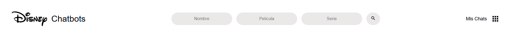
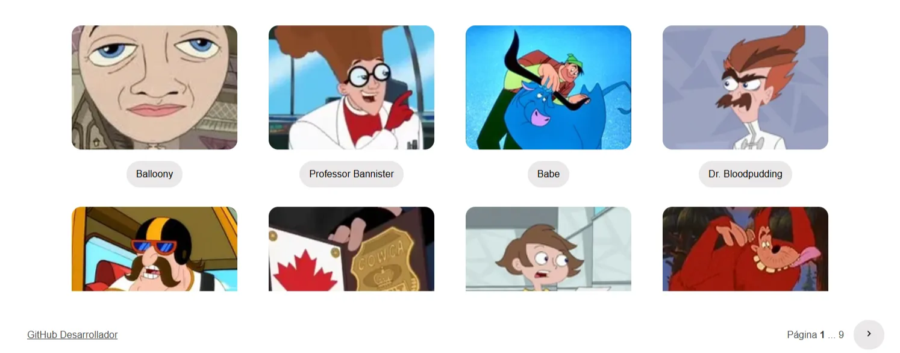
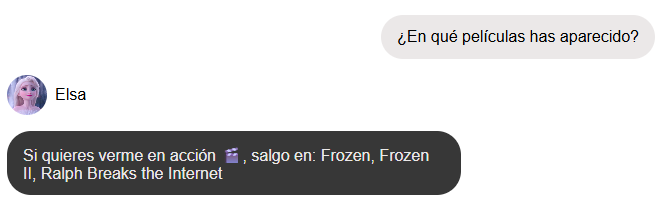
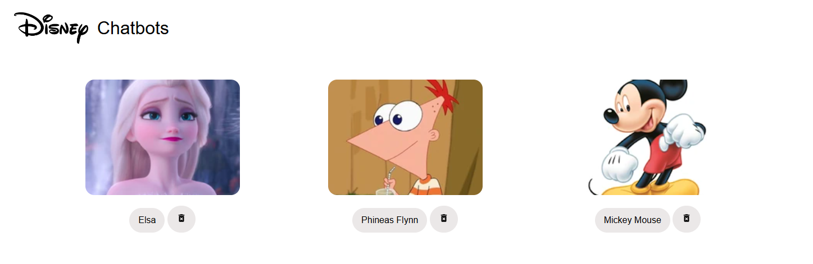

# 🧞 Documentación Disney Chatbots

Aplicación web que permite explorar personajes del universo Disney y preguntarles (a través de preguntas predefinidas) información sobre ellos. 

<p align="center">
  
  
  
  
  
</p>

---

# 🚀 Cómo probar el proyecto

1. Clona el repositorio:
    
    ```bash
    git clone https://github.com/SergioGMunoz/Disney-Chatbots
    ```
    
2. Abre el archivo `index.html` en tu navegador favorito.  

---

# ✨ Funcionalidades principales

1. **Filtrado de personajes** por nombre, película y/o serie de televisión.
    
    
    
2. **Visualización de fichas** de personaje (nombre, imagen, películas...).
    
    
    
3. **Chat** con respuestas predefinidas únicas para cada personaje.
    
    
    
4. **Recuperación** del chat con `localStorage` al volver a cargar la app.
    
    

---

# 🌐 API utilizada

[**Disney API (disneyapi.dev)**](https://disneyapi.dev/)

### 📌 Endpoint usado

`GET /characters` Lista de personajes paginada

```json
{
  "data": [
    {
      "_id": "12345",
      "name": "Mickey Mouse",
      "films": ["Fantasia", "Steamboat Willie"],
      "imageUrl": "https://...jpg"
    }
  ]
}
```

## 🎨 Diseño UX/UI

El diseño fue creado previamente en Figma, cuidando la estética simple y funcional.


## 📁 Estructura del código

El proyecto está estructurado de forma muy simple, cada archivo js se encarga de gestionar su propia página con funciones independientes a las otras.


## 🧩 Estructura de datos

Los datos, información de los personajes guardados, mensajes enviados se guardan el local storage en el siguiente formato:

```json
// Objeto llamado chats
    "ID DEL PERSONAJE": {
        "info": {
            // Toda la info del personaje
             "name": "Nombre",
            "imageUrl": "https:// ..."
        },
        "messages": [
            {
                "type": "user",
                "msg": "Mensaje enviado por el usuario"
            },
            {
                "type": "IA",
                "msg": "Respuesta predefinida del chatbot"
            },
        ]
    },
    "ID OTRO PERSONAJE": {
        "info": {},
        "messages": []
}
```
